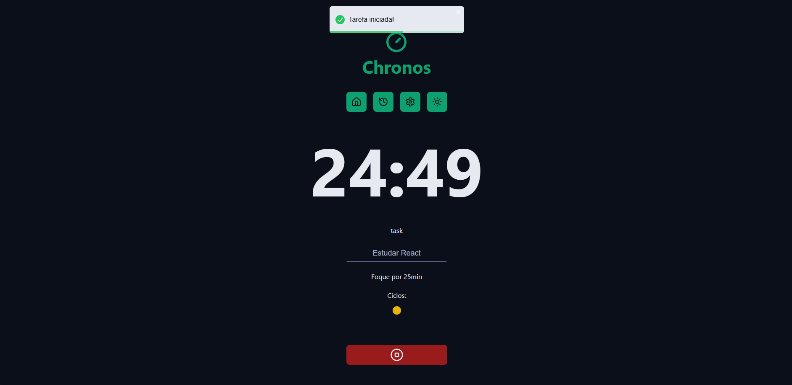

# ⏱️ Chronos Pomodoro

Chronos Pomodoro é uma aplicação de gerenciamento de tempo baseada na Técnica Pomodoro. Com ela, você pode organizar suas tarefas, alternar entre períodos de foco e descanso, visualizar seu histórico e personalizar os tempos conforme sua preferência. Tudo isso com uma interface moderna, modo escuro e performance otimizada com React + Vite.



## 🚀 Tecnologias

- [React 19](https://react.dev/)
- [Vite 6](https://vitejs.dev/)
- [TypeScript](https://www.typescriptlang.org/)
- [React Router 7](https://reactrouter.com/en/main)
- [Lucide Icons](https://lucide.dev/)
- [React Toastify](https://fkhadra.github.io/react-toastify/)
- [date-fns](https://date-fns.org/)

## ✨ Funcionalidades

- Início de sessões de foco, descanso curto e descanso longo
- Histórico de sessões com status e duração
- Personalização dos tempos de cada etapa
- Modo escuro incluso 🌙
- Interface simples e responsiva
- Notificações toast ao iniciar/encerrar sessões

## 🛠️ Instalação e uso local

```bash
# Clone o repositório
git clone https://github.com/seu-usuario/react-pomodoro.git
cd react-pomodoro

# Instale as dependências
npm install

# Rode em modo de desenvolvimento
npm run dev
```

## 📝 Licença

Este projeto foi desenvolvido como parte do curso [Curso de React.js e Next.js Completo](https://www.udemy.com/course/curso-de-reactjs-nextjs-completo-do-basico-ao-avancado) na Udemy.  
Você pode usá-lo como base para estudos e projetos pessoais.  
**Não é recomendado para produção sem as devidas adaptações.**
